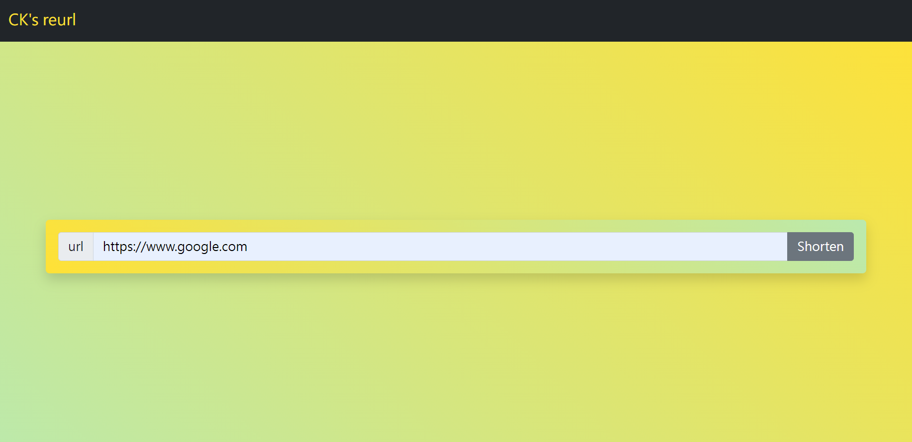
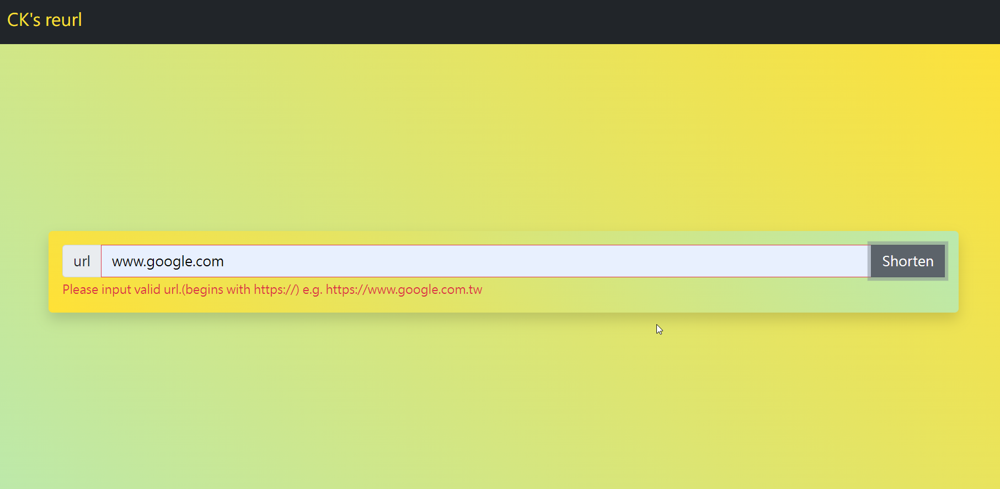
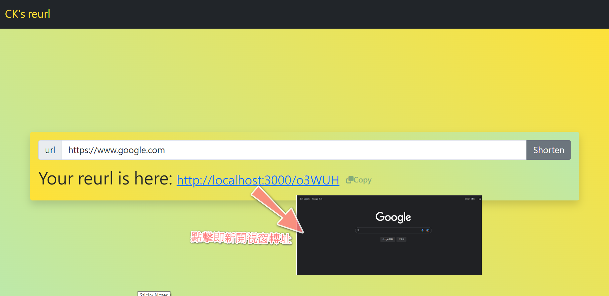

# url shortener
將長長的網址縮短成固定格式(`http://localhost:3000/"5碼隨機碼"`)

首頁

輸入驗證(必填且須為`https://`開頭格式)

點擊短網址立即轉址

單擊秒複製短網址

## 功能詳情
+ 輸入網址生成短網址(網址與短網址為一對一對應關係)。
  i.e. 將`https://www.ck.com`縮址得到`http://localhost:3000/ab123`, 下次再輸入`https://www.ck.com`進行縮址也會得到`http://localhost:3000/ab123`
+ 輸入驗證(必填且須為`https://`開頭格式)。
+ 點擊copy按鍵自動複製短網址。
+ 點擊短網址轉址新開視窗至原網址。

## 安裝執行
1. 確認安裝node.js & npm。
2. 開啟Terminal將專案 clone 至本地位置： `git clone https://github.com/Gincoolwant/reurl.git`
3. 開啟Terminal並移至專案資料夾安裝使用套件： `npm install`
4. 請設定你的環境變數： `MongoDB_URI_REURL="Your MongoDB connection string"`
5. 執行專案： `npm run start`
6. 成功連線會看見訊息： 

   `App is connecting on http://localhost:3000`

   `MongoDB is connecting`
 
   請開啟瀏覽器輸入網址 http://localhost:3000 進入首頁。

## 開發環境與工具
+ [Visual Studio Code](https://visualstudio.microsoft.com/zh-hant/)
+ [Node.js@16.17.0](https://nodejs.org/en/)
+ [Express@4.18.2](https://www.npmjs.com/package/express)
+ [Express-Handlebars@6.0.6](https://www.npmjs.com/package/express-handlebars)
+ [Bootstrap@v5.2](https://getbootstrap.com/)
+ [Font-awesome@6.2.0](https://fontawesome.com/)
+ [Body-parser@1.20.1](https://www.npmjs.com/package/body-parser)
+ [Method-override@3.0.0](https://www.npmjs.com/package/method-override)
+ [MongoDB Cloud](https://www.mongodb.com/)
+ [Mongoose@6.6.5](https://mongoosejs.com/)

## 開發人員
[CK](https://github.com/Gincoolwant)